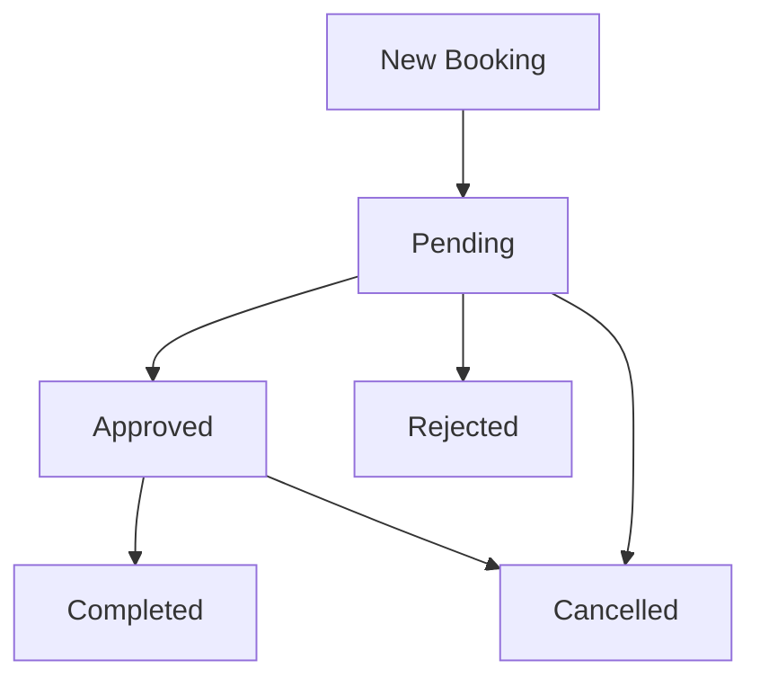
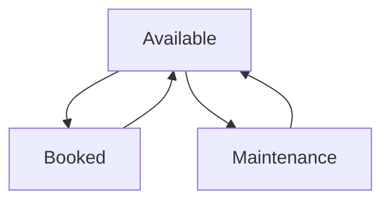
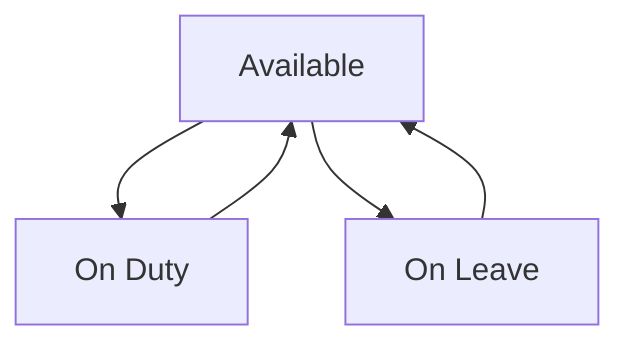

# Features Memory Bank

## Core Features

### 1. Vehicle Management
- Vehicle type categorization (Sedan, SUV, Van)
- Vehicle status tracking
- Unique plate number validation
- Vehicle availability monitoring
- Type-based organization
- Vehicle maintenance tracking

### 2. Driver Management
- Driver status tracking
- License number validation
- Contact information management
- Schedule tracking
- Availability monitoring
- Active booking tracking

### 3. Booking System
- Date range selection
- Conflict prevention
- Status workflow
- Purpose documentation
- User assignment
- Vehicle selection
- Driver assignment

### 4. Calendar Integration
- FullCalendar.js implementation
- Color-coded status display
- Month/week/day views
- Direct booking access
- Real-time updates
- Interactive interface

## Business Logic

### 1. Booking Workflow


Status Rules:
- Pending → Initial state
- Approved → After review
- Rejected → If not suitable
- Completed → After usage
- Cancelled → User/admin cancellation

### 2. Vehicle Status Management


Transition Rules:
- Available → Default state
- Booked → When booking approved
- Maintenance → Manual setting
- Auto-update based on bookings

### 3. Driver Status Management


Transition Rules:
- Available → Default state
- On Duty → When booking active
- On Leave → Manual setting
- Auto-update based on bookings

## Validation Rules

### 1. Booking Validation
```php
Rules:
- start_datetime must be future
- end_datetime after start_datetime
- vehicle must be available
- driver must be available
- no overlapping bookings
- valid purpose provided
```

### 2. Vehicle Validation
```php
Rules:
- valid vehicle type
- unique plate number
- valid status value
- name required
```

### 3. Driver Validation
```php
Rules:
- unique license number
- valid contact number
- valid status value
- name required
```

## User Interface Components

### 1. Forms
- Smart relationship selects
- Date/time pickers
- Status selectors
- Validation feedback
- Real-time updates

### 2. Tables
- Sortable columns
- Searchable content
- Status filters
- Date range filters
- Action buttons

### 3. Calendar
- Interactive booking display
- Status color coding
- Navigation controls
- Event details
- Quick actions

## Integration Points

### 1. Model Relationships
```php
VehicleType -> Vehicle -> Booking <- Driver
                      ^
                      |
                     User
```

### 2. Status Synchronization
- Booking status affects vehicle availability
- Booking status affects driver availability
- Automatic status updates
- Manual override capabilities

### 3. Calendar Integration
- Booking data transformation
- Real-time updates
- Event handling
- Status visualization

## Security Features

### 1. Data Validation
- Input sanitization
- Type checking
- Relationship validation
- Status validation

### 2. Access Control
- Resource-based permissions
- Status-based restrictions
- User-based filtering
- Action validation

### 3. Data Integrity
- Foreign key constraints
- Unique constraints
- Status consistency
- Date validation

## Testing Considerations

### 1. Unit Tests
- Model relationships
- Status transitions
- Validation rules
- Business logic

### 2. Feature Tests
- Booking workflow
- Status management
- Calendar integration
- Form submission

### 3. Integration Tests
- End-to-end booking
- Status synchronization
- Calendar updates
- Data consistency

## Future Enhancements

### 1. Potential Features
- Maintenance scheduling
- Cost tracking
- Reports/Analytics
- Mobile app integration
- GPS tracking
- Automated notifications

### 2. Scalability
- Multiple locations
- Vehicle categories
- Driver specializations
- Booking types
- Status workflows

### 3. Integration
- Payment systems
- GPS services
- SMS notifications
- Mobile apps
- External calendars
