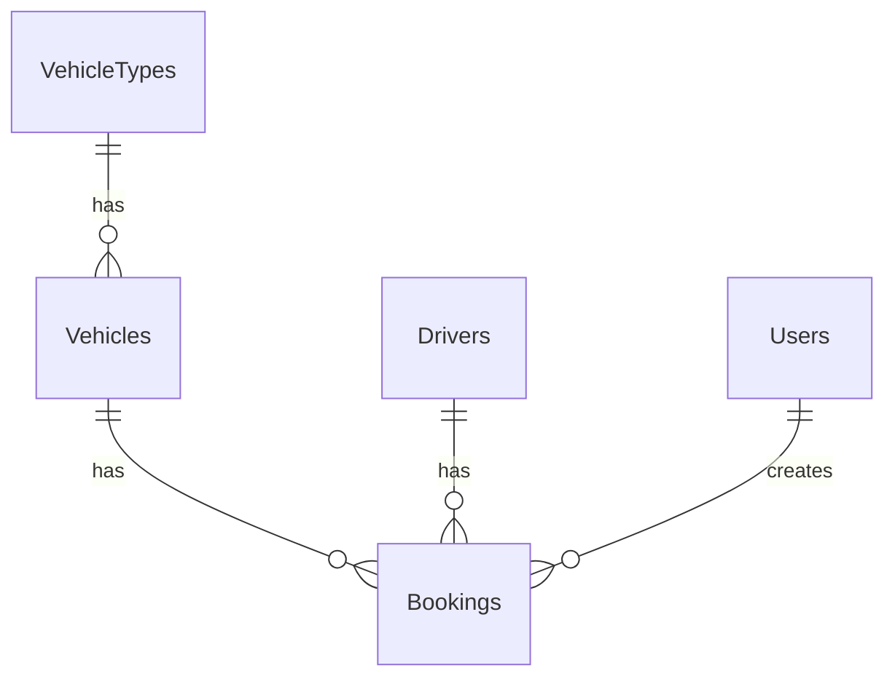

# Vehicle Booking System Memory Bank

## Directory Structure
```
.cline/memory/
├── models/
│   └── models.md         # Model definitions, relationships, and business logic
├── resources/
│   └── filament.md       # Filament resources, forms, and UI components
├── migrations/
│   └── migrations.md     # Database structure and migration details
├── features/
│   └── features.md       # System features, workflows, and business rules
└── index.md             # This file
```

## Quick Reference

### Models
- [Models Documentation](models/models.md)
  - VehicleType: Vehicle categorization
  - Vehicle: Vehicle management with status
  - Driver: Driver management with availability
  - Booking: Booking system with workflow

### Filament Resources
- [Resources Documentation](resources/filament.md)
  - Navigation structure
  - Resource configurations
  - Form and table layouts
  - Calendar integration

### Database Structure
- [Migrations Documentation](migrations/migrations.md)
  - Migration order
  - Table structures
  - Relationships
  - Constraints

### Features & Business Logic
- [Features Documentation](features/features.md)
  - Core features
  - Business workflows
  - Validation rules
  - Future enhancements

## Key System Concepts

### Status Workflows
1. Booking Status:
   - pending → approved/rejected
   - approved → completed/cancelled

2. Vehicle Status:
   - available ↔ booked
   - available ↔ maintenance

3. Driver Status:
   - available ↔ on_duty
   - available ↔ on_leave

### Data Relationships


### Core Features
1. Vehicle Management
   - Type categorization
   - Status tracking
   - Availability monitoring

2. Driver Management
   - Schedule tracking
   - Status management
   - Contact information

3. Booking System
   - Date range selection
   - Conflict prevention
   - Status workflow

4. Calendar Integration
   - Visual booking display
   - Interactive interface
   - Status color coding

## System Requirements

### Technical Stack
- Laravel 12.0
- Filament 3.3
- PHP 8.2+
- MariaDB/MySQL

### Key Dependencies
- FullCalendar.js for calendar view
- Filament for admin panel
- Laravel's built-in authentication

## Best Practices

### Code Organization
- Models in app/Models
- Resources in app/Filament/Resources
- Migrations in database/migrations
- Views in resources/views/filament

### Naming Conventions
- Models: Singular (Vehicle, Driver)
- Tables: Plural (vehicles, drivers)
- Resources: Singular + Resource (VehicleResource)

### Development Guidelines
- Follow SOLID principles
- Use type hints and return types
- Document complex logic
- Write comprehensive tests

## Maintenance Notes

### Database
- Run migrations in correct order
- Use foreign key constraints
- Maintain unique constraints
- Handle status transitions

### Features
- Validate date ranges
- Check for booking conflicts
- Manage status transitions
- Update related records

### UI/UX
- Provide clear feedback
- Use consistent status colors
- Maintain responsive design
- Ensure intuitive navigation
