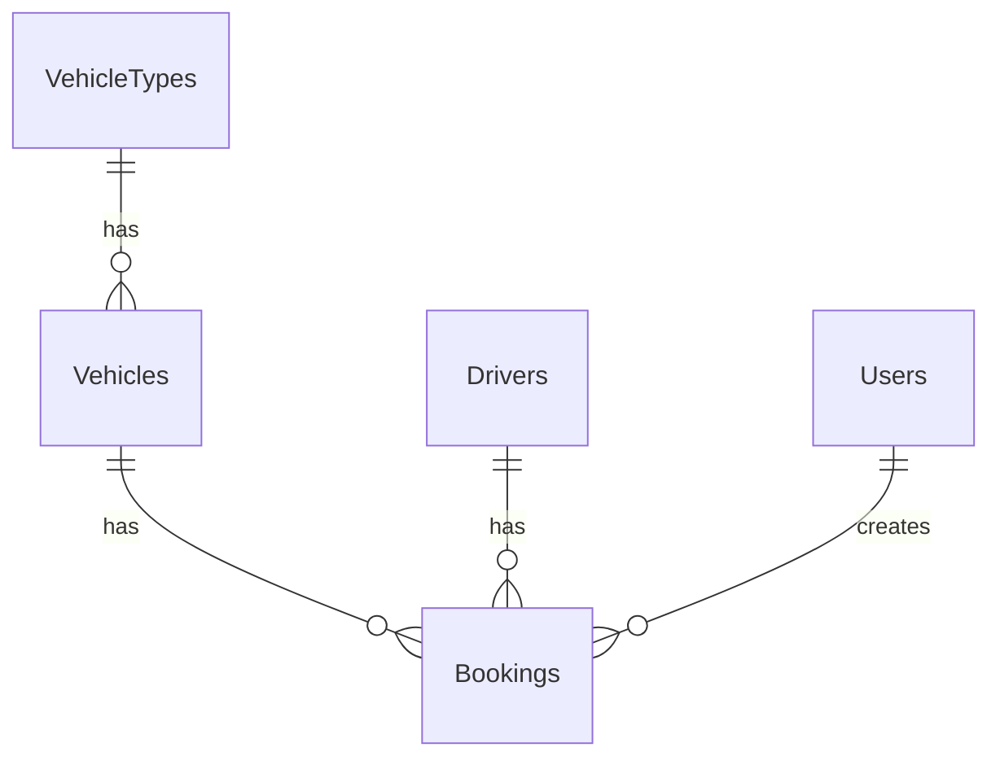

# Models Memory Bank

## VehicleType Model
```php
class VehicleType extends Model
{
    protected $fillable = ['name', 'description'];
    
    // Relationships
    public function vehicles() {
        return $this->hasMany(Vehicle::class);
    }
}
```
Key Points:
- Used for categorizing vehicles (Sedan, SUV, Van)
- One-to-many relationship with vehicles
- Simple structure with name and description

## Vehicle Model
```php
class Vehicle extends Model
{
    const STATUS_AVAILABLE = 'available';
    const STATUS_BOOKED = 'booked';
    const STATUS_MAINTENANCE = 'maintenance';

    protected $fillable = [
        'vehicle_type_id',
        'name',
        'plate_number',
        'status',
    ];

    // Relationships
    public function vehicleType() {
        return $this->belongsTo(VehicleType::class);
    }

    public function bookings() {
        return $this->hasMany(Booking::class);
    }

    // Scopes & Helpers
    public function scopeAvailable($query) {
        return $query->where('status', self::STATUS_AVAILABLE);
    }

    public function isAvailable(): bool {
        return $this->status === self::STATUS_AVAILABLE;
    }
}
```
Key Points:
- Status management (available, booked, maintenance)
- Belongs to a vehicle type
- Has many bookings
- Includes availability helpers
- Unique plate numbers

## Driver Model
```php
class Driver extends Model
{
    const STATUS_AVAILABLE = 'available';
    const STATUS_ON_DUTY = 'on_duty';
    const STATUS_ON_LEAVE = 'on_leave';

    protected $fillable = [
        'name',
        'license_number',
        'contact_number',
        'status',
    ];

    // Relationships
    public function bookings() {
        return $this->hasMany(Booking::class);
    }

    // Scopes & Helpers
    public function scopeAvailable($query) {
        return $query->where('status', self::STATUS_AVAILABLE);
    }

    public function isAvailable(): bool {
        return $this->status === self::STATUS_AVAILABLE;
    }

    public function activeBookings() {
        return $this->bookings()
            ->whereIn('status', ['pending', 'approved'])
            ->where('end_datetime', '>=', now());
    }
}
```
Key Points:
- Status management (available, on_duty, on_leave)
- Has many bookings
- Includes availability and schedule management
- Unique license numbers
- Contact information tracking

## Booking Model
```php
class Booking extends Model
{
    const STATUS_PENDING = 'pending';
    const STATUS_APPROVED = 'approved';
    const STATUS_REJECTED = 'rejected';
    const STATUS_COMPLETED = 'completed';
    const STATUS_CANCELLED = 'cancelled';

    protected $fillable = [
        'vehicle_id',
        'driver_id',
        'user_id',
        'start_datetime',
        'end_datetime',
        'purpose',
        'status',
    ];

    protected $casts = [
        'start_datetime' => 'datetime',
        'end_datetime' => 'datetime',
    ];

    // Relationships
    public function vehicle() {
        return $this->belongsTo(Vehicle::class);
    }

    public function driver() {
        return $this->belongsTo(Driver::class);
    }

    public function user() {
        return $this->belongsTo(User::class);
    }

    // Scopes & Helpers
    public function scopeActive($query) {
        return $query->whereIn('status', [self::STATUS_PENDING, self::STATUS_APPROVED])
            ->where('end_datetime', '>=', now());
    }

    public function canBeCancelled(): bool {
        return in_array($this->status, [self::STATUS_PENDING, self::STATUS_APPROVED]) &&
            $this->start_datetime->isFuture();
    }

    public function isActive(): bool {
        return in_array($this->status, [self::STATUS_PENDING, self::STATUS_APPROVED]) &&
            $this->end_datetime->isFuture();
    }

    public function overlaps(self $booking): bool {
        return $this->start_datetime < $booking->end_datetime &&
            $this->end_datetime > $booking->start_datetime;
    }
}
```
Key Points:
- Complex status workflow (pending, approved, rejected, completed, cancelled)
- Relationships to vehicle, driver, and user
- DateTime handling
- Booking validation and conflict checking
- Active booking management
- Cancellation rules

## Model Relationships Overview


## Key Business Rules
1. Vehicle availability:
   - Cannot be double-booked
   - Must be in 'available' status
   - Must belong to a valid vehicle type

2. Driver availability:
   - Cannot be double-booked
   - Must be in 'available' status
   - Must have valid license

3. Booking constraints:
   - Must have future start date
   - End date must be after start date
   - No overlapping bookings
   - Status transitions must follow workflow
