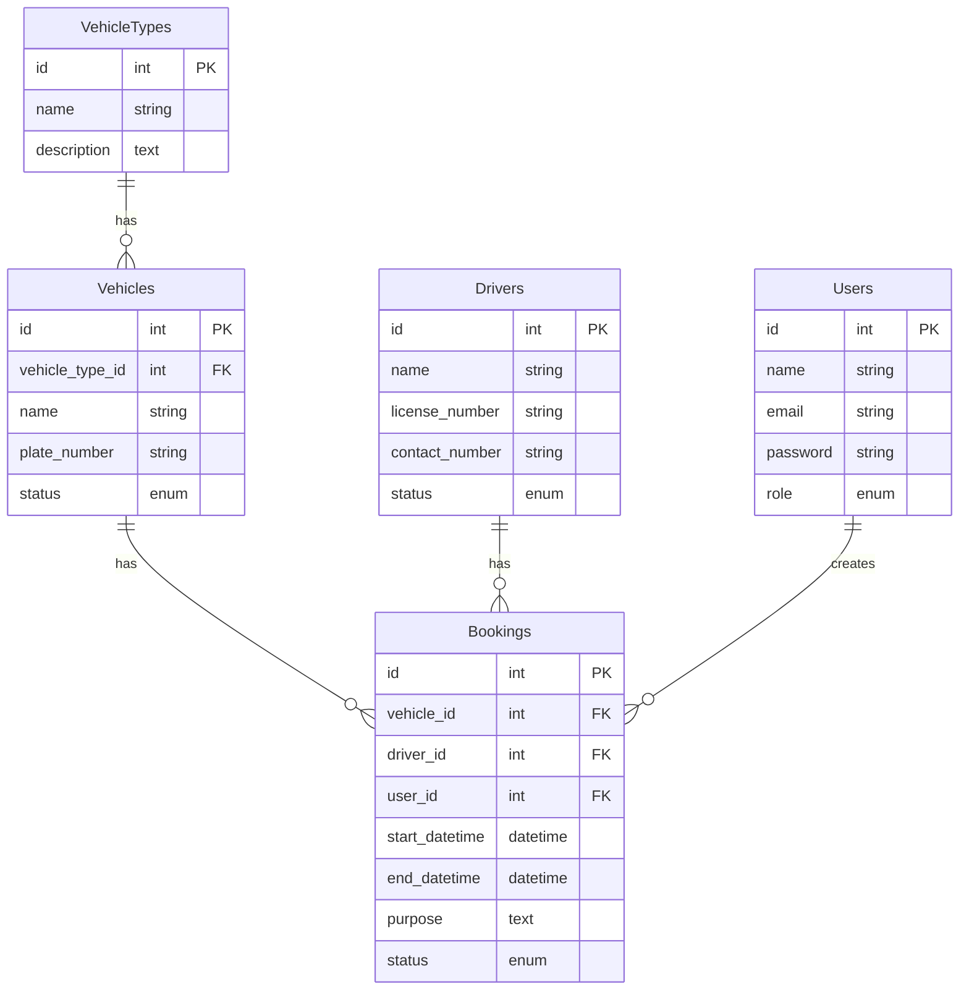

# Vehicle Booking System

A comprehensive vehicle booking management system built with Laravel and Filament Admin Panel.

## Architecture Overview

### Database Structure


### Models & Relationships

1. VehicleType Model
- Has many vehicles
- Attributes: name, description
- Used for categorizing vehicles

2. Vehicle Model
- Belongs to a vehicle type
- Has many bookings
- Status states: available, booked, maintenance
- Includes availability checking logic

3. Driver Model
- Has many bookings
- Status states: available, on_duty, on_leave
- Includes schedule management logic

4. Booking Model
- Belongs to vehicle, driver, and user
- Status states: pending, approved, rejected, completed, cancelled
- Includes validation and conflict checking

### Filament Resources

1. VehicleTypeResource
- CRUD operations for vehicle types
- Displays associated vehicles count
- Searchable and sortable fields

2. VehicleResource
- Vehicle management with type selection
- Status management
- Relationship with vehicle types
- Quick status updates

3. DriverResource
- Driver information management
- License and contact details
- Status tracking
- Active bookings display

4. BookingResource
- Smart booking form with:
  - Vehicle selection
  - Available driver filtering
  - Date range validation
  - Status management
- Comprehensive filters
- Calendar view integration

### Calendar Integration

- FullCalendar.js integration
- Color-coded booking status
- Month/week/day views
- Direct booking access
- Real-time updates

### Business Rules

1. Booking Validation
- No overlapping bookings
- Driver availability check
- Vehicle availability check
- Date range validation

2. Status Management
- Vehicle status synchronization
- Driver status updates
- Booking workflow states

3. Access Control
- Role-based permissions
- Booking approval workflow
- Resource access restrictions

## Technical Implementation

### Key Files Structure
```
app/
├── Models/
│   ├── VehicleType.php
│   ├── Vehicle.php
│   ├── Driver.php
│   └── Booking.php
├── Filament/
│   ├── Resources/
│   │   ├── VehicleTypeResource/
│   │   ├── VehicleResource/
│   │   ├── DriverResource/
│   │   └── BookingResource/
│   └── Pages/
│       └── Calendar.php
```

### Migration Order
1. create_vehicle_types_table
2. create_vehicles_table
3. create_drivers_table
4. create_bookings_table

### Features
- Modern UI with Filament
- Responsive calendar view
- Smart form validation
- Real-time availability checking
- Comprehensive filtering
- Status management
- Booking workflow

### Best Practices
- SOLID principles
- DRY code
- Modular design
- Relationship integrity
- Data validation
- Business logic encapsulation

This documentation serves as a memory bank for the vehicle booking system's architecture and implementation details.
