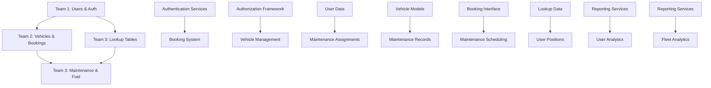

# Team Development Documentation

## Overview
This directory contains comprehensive documentation for the 3-team development approach for the Fleet Management System. The documentation ensures coordinated development while preventing file conflicts and maintaining system integrity.

---

## 📁 Documentation Structure

### Team-Specific Documentation
- **[team1-user-management.md](./team1-user-management.md)** - Core Infrastructure & User Management
- **[team2-vehicle-operations.md](./team2-vehicle-operations.md)** - Vehicle Management & Operations
- **[team3-maintenance-admin.md](./team3-maintenance-admin.md)** - Maintenance & Administration

### Coordination Documentation
- **[development-coordination.md](./development-coordination.md)** - Cross-team coordination strategy
- **[shared-interfaces.md](./shared-interfaces.md)** - API contracts and integration points

---

## 🏗️ Team Structure

### Team 1: Core Infrastructure & User Management
**Primary Focus**: Foundation systems and security
- Laravel 11 setup and configuration
- Filament 3.x installation and setup
- User authentication and authorization
- Role-based access control (RBAC)
- Security policies and middleware
- Dashboard foundation

**Key Deliverables**:
- ✅ Authentication system
- ✅ User management interface
- ✅ Authorization framework
- ✅ Security middleware

### Team 2: Vehicle Management & Operations
**Primary Focus**: Core business logic and booking system
- Vehicle CRUD operations
- Polymorphic booking system implementation
- Driver management and scheduling
- Calendar integration
- Conflict detection and resolution

**Key Deliverables**:
- ✅ Vehicle management system
- ✅ Polymorphic booking interface
- ✅ Calendar integration
- ✅ Driver scheduling

### Team 3: Maintenance & Administration
**Primary Focus**: Support systems and data management
- Maintenance tracking and scheduling
- Fuel card management
- Lookup data management
- Reporting and analytics
- System administration features

**Key Deliverables**:
- ✅ Maintenance management system
- ✅ Fuel management system
- ✅ Reporting dashboard
- ✅ Administrative tools

---

## 📅 Development Timeline

### Phase 1: Foundation (Week 1-2)
**Parallel Development - Minimal Dependencies**

| Week | Team 1 | Team 2 | Team 3 |
|------|--------|--------|--------|
| **1** | Laravel setup, User migrations | Vehicle models, Database schema | Lookup tables, Maintenance schema |
| **2** | Authentication system, Basic RBAC | Driver models, Basic relationships | Fuel card schema, Basic models |

### Phase 2: Core Implementation (Week 2-3)
**Coordinated Development - Key Integrations**

| Week | Team 1 | Team 2 | Team 3 |
|------|--------|--------|--------|
| **2** | Authorization policies, Middleware | Polymorphic booking system | Maintenance services |
| **3** | User management interface | Calendar integration | Fuel management services |

### Phase 3: Interface Development (Week 3-4)
**Independent Development - UI Focus**

| Week | Team 1 | Team 2 | Team 3 |
|------|--------|--------|--------|
| **3** | Dashboard foundation | Filament resources | Maintenance interface |
| **4** | User widgets | Booking workflows | Reporting dashboard |

### Phase 4: Integration & Testing (Week 4-5)
**Collaborative Development - System Integration**

| Week | Team 1 | Team 2 | Team 3 |
|------|--------|--------|--------|
| **4** | Cross-team integration | Advanced features | System administration |
| **5** | Testing & documentation | Performance optimization | Final integration |

---

## 🔗 Integration Dependencies



---

## 📋 File Ownership Matrix

### Team 1 Owned Files
```
app/Models/User/
app/Policies/UserPolicy.php
app/Http/Middleware/
app/Filament/Resources/UserResource.php
app/Services/AuthService.php
database/migrations/*_users_*.php
config/auth.php
```

### Team 2 Owned Files
```
app/Models/Fleet/
app/Contracts/BookableInterface.php
app/Services/BookingService.php
app/Filament/Resources/VehicleResource.php
app/Filament/Pages/Calendar.php
database/migrations/*_vehicles_*.php
database/migrations/*_bookings_*.php
```

### Team 3 Owned Files
```
app/Models/System/
app/Services/MaintenanceService.php
app/Filament/Resources/MaintenanceResource.php
app/Filament/Pages/ReportsPage.php
database/migrations/*_maintenance_*.php
database/migrations/*_lookup_*.php
```

---

## 🚀 Quick Start Guide

### For Team Leads
1. **Read your team's specific documentation** (team1/2/3-*.md)
2. **Review shared interfaces** (shared-interfaces.md)
3. **Understand coordination protocols** (development-coordination.md)
4. **Set up daily standups** and weekly integration meetings
5. **Establish code review processes** within your team

### For Developers
1. **Familiarize yourself with your team's responsibilities**
2. **Understand the interfaces your team provides/consumes**
3. **Follow the file ownership rules**
4. **Participate in cross-team code reviews for shared components**
5. **Write tests for your components with >80% coverage**

### For Project Managers
1. **Monitor cross-team dependencies** and resolve blockers
2. **Coordinate integration testing sessions**
3. **Track progress against phase milestones**
4. **Facilitate communication between teams**
5. **Manage scope and timeline adjustments**

---

## 📞 Communication Protocols

### Daily Coordination (9:00 AM - 15 minutes)
**Participants**: All team leads + 1 developer from each team
- Progress updates (2 min per team)
- Blockers and dependencies (5 min)
- Integration coordination (5 min)
- Next day planning (3 min)

### Weekly Integration Meetings (Friday 2:00 PM - 60 minutes)
**Participants**: All team members
- Integration testing results
- Cross-team code reviews
- Shared interface updates
- Next week planning
- Risk assessment

### Escalation Process
1. **Technical Issues**: Team Lead → Technical Architect
2. **Integration Conflicts**: Team Leads meeting → Project Manager
3. **Timeline Issues**: Team Lead → Project Manager
4. **Resource Conflicts**: Project Manager → Stakeholders

---

## 🧪 Testing Strategy

### Testing Levels
1. **Unit Tests**: Each team tests their components (>80% coverage)
2. **Integration Tests**: Cross-team functionality testing
3. **System Tests**: Full system workflow testing
4. **Performance Tests**: Load and stress testing

### Testing Schedule
- **Daily**: Unit tests run automatically on commit
- **Weekly**: Integration tests run every Friday
- **Bi-weekly**: Full system tests
- **Monthly**: Performance and load tests

---

## 📊 Success Metrics

### Development Success Criteria
- [ ] All teams complete their phases on time
- [ ] Integration testing passes with <5% failure rate
- [ ] Code coverage exceeds 80% across all teams
- [ ] Performance requirements met
- [ ] Zero critical security vulnerabilities

### Quality Gates
1. **Code Quality**: PSR-12 compliance, static analysis
2. **Test Coverage**: Minimum 80% unit test coverage
3. **Performance**: Page load times <2 seconds
4. **Security**: Security scan passes, no vulnerabilities
5. **Documentation**: All interfaces documented

---

## ⚠️ Risk Management

### Common Risks & Mitigation

| Risk | Impact | Probability | Mitigation |
|------|--------|-------------|------------|
| **Team 1 Delays** | High | Medium | Mock authentication for other teams |
| **Integration Conflicts** | High | Medium | Early interface definition, regular testing |
| **Database Migration Issues** | Medium | Low | Careful coordination, rollback procedures |
| **Performance Issues** | Medium | Medium | Regular performance testing, optimization |
| **Communication Breakdown** | High | Low | Structured meetings, clear documentation |

### Contingency Plans
1. **Team Blocking**: Temporary mock implementations
2. **Integration Failures**: Rollback to last working version
3. **Performance Issues**: Immediate optimization sprint
4. **Timeline Delays**: Scope reduction or resource reallocation

---

## 📚 Documentation Standards

### Required Documentation
1. **API Documentation**: All interfaces and services
2. **Database Schema**: ERD and table documentation
3. **User Guides**: Feature documentation for end users
4. **Technical Guides**: Setup and maintenance procedures
5. **Testing Documentation**: Test plans and procedures

### Documentation Format
- **Code Comments**: PHPDoc format for all public methods
- **API Documentation**: OpenAPI/Swagger format
- **User Documentation**: Markdown format in docs/ folder
- **Technical Documentation**: Confluence or similar wiki

---

## 🔄 Version Control Strategy

### Branch Strategy
```
main
├── team1/feature-branch
├── team2/feature-branch
└── team3/feature-branch
```

### Commit Message Format
```
[TEAM-X] TYPE: Brief description

Detailed description of changes
- Specific change 1
- Specific change 2

Closes #issue-number
```

### Code Review Process
1. **Internal Reviews**: All code reviewed within team before commit
2. **Cross-Team Reviews**: Interface changes require other team approval
3. **Shared Component Reviews**: All teams review shared utilities
4. **Integration Reviews**: Joint review sessions for integration points

---

## 📈 Progress Tracking

### Weekly Progress Reports
Each team lead provides:
- **Completed Tasks**: What was finished this week
- **In Progress**: Current work and expected completion
- **Blockers**: Issues preventing progress
- **Next Week**: Planned work and dependencies
- **Risks**: Potential issues and mitigation plans

### Integration Milestones
- **Week 2**: Team 1 authentication ready for integration
- **Week 3**: Team 2 booking system ready for integration
- **Week 4**: Team 3 maintenance system ready for integration
- **Week 5**: Full system integration complete

---

## 🎯 Definition of Done

### Team Level
- [ ] All assigned tasks completed
- [ ] Unit tests written and passing (>80% coverage)
- [ ] Code reviewed and approved
- [ ] Documentation updated
- [ ] Integration points tested

### System Level
- [ ] All teams integrated successfully
- [ ] System tests passing
- [ ] Performance requirements met
- [ ] Security requirements met
- [ ] User acceptance criteria met

---

## 📞 Contact Information

### Team Leads
- **Team 1 Lead**: [Name] - [Email] - [Phone]
- **Team 2 Lead**: [Name] - [Email] - [Phone]
- **Team 3 Lead**: [Name] - [Email] - [Phone]

### Project Management
- **Project Manager**: [Name] - [Email] - [Phone]
- **Technical Architect**: [Name] - [Email] - [Phone]
- **Quality Assurance Lead**: [Name] - [Email] - [Phone]

### Stakeholders
- **Product Owner**: [Name] - [Email] - [Phone]
- **Business Analyst**: [Name] - [Email] - [Phone]

---

**Document Version**: 1.0  
**Last Updated**: May 23, 2025  
**Next Review**: Weekly during development  
**Owner**: Project Manager  
**Reviewers**: All Team Leads

---

*This documentation is a living document and will be updated regularly throughout the development process. All team members are expected to familiarize themselves with their team's documentation and the coordination guidelines.*
