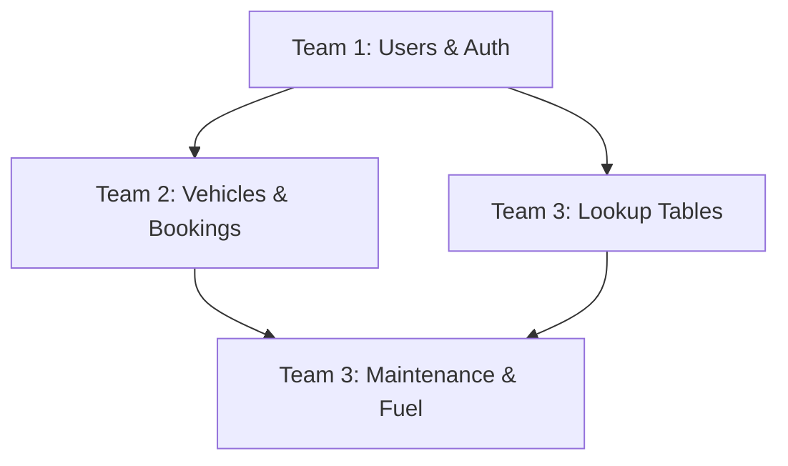
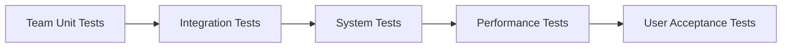

# Development Coordination Guide

## Overview
This document outlines the coordination strategy for the 3-team development approach for the Fleet Management System. It ensures smooth collaboration, prevents conflicts, and maintains system integrity across all teams.

---

## Team Structure & Responsibilities

### 🏗️ Team 1: Core Infrastructure & User Management
- **Lead Focus**: Foundation systems and security
- **Key Deliverables**: Authentication, authorization, user management
- **Critical Dependencies**: None (foundation team)
- **Provides To**: Authentication services, user data, security framework

### 🚗 Team 2: Vehicle Management & Operations  
- **Lead Focus**: Core business logic and booking system
- **Key Deliverables**: Vehicle CRUD, polymorphic booking system, calendar
- **Critical Dependencies**: Team 1 (authentication)
- **Provides To**: Vehicle data, booking interface, calendar integration

### 🔧 Team 3: Maintenance & Administration
- **Lead Focus**: Support systems and data management
- **Key Deliverables**: Maintenance tracking, fuel management, reporting
- **Critical Dependencies**: Team 1 (authentication), Team 2 (vehicles)
- **Provides To**: Maintenance data, lookup tables, reporting services

---

## Development Phases & Timeline

### 📅 Phase 1: Foundation (Week 1-2)
**Parallel Development - Minimal Dependencies**

| Team | Week 1 | Week 2 |
|------|--------|--------|
| **Team 1** | Laravel setup, Filament install, User migrations | Authentication system, Basic RBAC |
| **Team 2** | Vehicle models, Database schema | Driver models, Basic relationships |
| **Team 3** | Lookup tables, Maintenance schema | Fuel card schema, Basic models |

**Coordination Points:**
- Daily standup at 9:00 AM
- Database migration coordination
- Shared environment setup

### 📅 Phase 2: Core Implementation (Week 2-3)
**Coordinated Development - Key Integrations**

| Team | Week 2 | Week 3 |
|------|--------|--------|
| **Team 1** | Authorization policies, Middleware | User management interface |
| **Team 2** | Polymorphic booking system | Calendar integration |
| **Team 3** | Maintenance services | Fuel management services |

**Coordination Points:**
- Integration testing sessions
- Shared interface reviews
- Cross-team code reviews

### 📅 Phase 3: Interface Development (Week 3-4)
**Independent Development - UI Focus**

| Team | Week 3 | Week 4 |
|------|--------|--------|
| **Team 1** | Dashboard foundation | User widgets |
| **Team 2** | Filament resources | Booking workflows |
| **Team 3** | Maintenance interface | Reporting dashboard |

**Coordination Points:**
- UI/UX consistency reviews
- Navigation structure coordination
- Widget integration planning

### 📅 Phase 4: Integration & Testing (Week 4-5)
**Collaborative Development - System Integration**

| Team | Week 4 | Week 5 |
|------|--------|--------|
| **Team 1** | Cross-team integration | Testing & documentation |
| **Team 2** | Advanced features | Performance optimization |
| **Team 3** | System administration | Final integration |

**Coordination Points:**
- Full system testing
- Performance optimization
- Documentation completion

---

## File Organization Strategy

### 📁 Directory Structure by Team
```
app/
├── Models/
│   ├── User/               # Team 1
│   ├── Fleet/              # Team 2
│   └── System/             # Team 3
├── Filament/
│   ├── Resources/
│   │   ├── User/           # Team 1
│   │   ├── Vehicle/        # Team 2
│   │   └── Maintenance/    # Team 3
│   ├── Pages/
│   │   ├── Auth/           # Team 1
│   │   ├── Calendar/       # Team 2
│   │   └── Reports/        # Team 3
│   └── Widgets/
│       ├── User/           # Team 1
│       ├── Fleet/          # Team 2
│       └── Analytics/      # Team 3
├── Services/               # Organized by team responsibility
├── Policies/               # Organized by team responsibility
└── Http/
    ├── Middleware/         # Team 1 (shared)
    ├── Controllers/        # Team-specific
    └── Requests/           # Team-specific
```

### 🔒 File Ownership Rules
1. **Exclusive Ownership**: Each team owns specific files/directories
2. **No Direct Edits**: Teams cannot directly edit other teams' files
3. **Interface Changes**: Must be coordinated through team leads
4. **Shared Files**: Require approval from all affected teams

---

## Database Migration Strategy

### 🗄️ Migration Dependencies


### 📋 Migration Coordination Process
1. **Team 1** creates foundation migrations (users, roles, permissions)
2. **Team 3** creates lookup table migrations (can run parallel with Team 1)
3. **Team 2** creates vehicle and booking migrations (requires Team 1 completion)
4. **Team 3** creates maintenance migrations (requires Team 2 completion)

### 🔄 Migration Naming Convention
```
YYYY_MM_DD_HHMMSS_team[1|2|3]_create_[table_name]_table.php

Examples:
2025_05_23_100000_team1_create_users_table.php
2025_05_23_110000_team3_create_vehicle_types_table.php
2025_05_23_120000_team2_create_vehicles_table.php
2025_05_23_130000_team2_create_bookings_table.php
2025_05_23_140000_team3_create_maintenance_records_table.php
```

---

## Integration Points & Interfaces

### 🔗 Team 1 → Team 2 Integration
**Authentication & Authorization Services**

```php
// Provided by Team 1
interface AuthenticationServiceInterface
{
    public function getCurrentUser();
    public function checkPermission($permission);
    public function getUserDepartment();
}

// Used by Team 2
class BookingService
{
    public function __construct(
        private AuthenticationServiceInterface $auth
    ) {}
    
    public function createBooking($data)
    {
        $user = $this->auth->getCurrentUser();
        // Booking creation logic
    }
}
```

### 🔗 Team 2 → Team 3 Integration
**Vehicle & Booking Data Services**

```php
// Provided by Team 2
interface VehicleServiceInterface
{
    public function getVehicle($id);
    public function updateVehicleStatus($id, $status);
    public function getVehicleBookings($id);
}

// Used by Team 3
class MaintenanceService
{
    public function __construct(
        private VehicleServiceInterface $vehicleService
    ) {}
    
    public function scheduleMaintenance($vehicleId, $date)
    {
        $this->vehicleService->updateVehicleStatus($vehicleId, 'maintenance');
        // Maintenance scheduling logic
    }
}
```

### 🔗 Team 3 → All Teams Integration
**Lookup Data & Reporting Services**

```php
// Provided by Team 3
interface LookupServiceInterface
{
    public function getVehicleTypes();
    public function getPositions();
    public function getManufacturers();
}

interface ReportingServiceInterface
{
    public function generateReport($type, $parameters);
    public function exportData($model, $format);
}
```

---

## Communication Protocols

### 📞 Daily Coordination
**Time**: 9:00 AM (15 minutes)
**Participants**: All team leads + 1 developer from each team
**Format**: 
- Progress updates (2 min per team)
- Blockers and dependencies (5 min)
- Integration coordination (5 min)
- Next day planning (3 min)

### 📅 Weekly Integration Meetings
**Time**: Friday 2:00 PM (60 minutes)
**Participants**: All team members
**Agenda**:
- Integration testing results
- Cross-team code reviews
- Shared interface updates
- Next week planning
- Risk assessment

### 🚨 Escalation Process
1. **Technical Issues**: Team Lead → Technical Architect
2. **Integration Conflicts**: Team Leads meeting → Project Manager
3. **Timeline Issues**: Team Lead → Project Manager
4. **Resource Conflicts**: Project Manager → Stakeholders

---

## Code Review Process

### 👥 Review Requirements
1. **Internal Reviews**: All code reviewed within team before commit
2. **Cross-Team Reviews**: Interface changes require other team approval
3. **Shared Component Reviews**: All teams review shared utilities
4. **Integration Reviews**: Joint review sessions for integration points

### 📝 Review Checklist
- [ ] Code follows team coding standards
- [ ] No conflicts with other team files
- [ ] Interfaces properly documented
- [ ] Tests included for new functionality
- [ ] Database changes coordinated
- [ ] Performance impact assessed

---

## Testing Strategy

### 🧪 Testing Levels
1. **Unit Tests**: Each team tests their own components (>80% coverage)
2. **Integration Tests**: Cross-team functionality testing
3. **System Tests**: Full system workflow testing
4. **Performance Tests**: Load and stress testing

### 🔄 Testing Coordination


### 📋 Testing Schedule
- **Daily**: Unit tests run automatically on commit
- **Weekly**: Integration tests run every Friday
- **Bi-weekly**: Full system tests
- **Monthly**: Performance and load tests

---

## Deployment Coordination

### 🚀 Deployment Strategy
1. **Development Environment**: Continuous deployment from main branch
2. **Staging Environment**: Weekly deployments for integration testing
3. **Production Environment**: Coordinated releases every 2 weeks

### 📦 Release Process
1. **Feature Freeze**: All teams stop new features 2 days before release
2. **Integration Testing**: Full system testing in staging
3. **Release Preparation**: Database migrations, configuration updates
4. **Coordinated Deployment**: All teams deploy simultaneously
5. **Post-Deployment Testing**: Smoke tests and monitoring

---

## Risk Management

### ⚠️ Common Risks & Mitigation

| Risk | Impact | Probability | Mitigation |
|------|--------|-------------|------------|
| **Team 1 Delays** | High | Medium | Mock authentication for other teams |
| **Integration Conflicts** | High | Medium | Early interface definition, regular testing |
| **Database Migration Issues** | Medium | Low | Careful coordination, rollback procedures |
| **Performance Issues** | Medium | Medium | Regular performance testing, optimization |
| **Communication Breakdown** | High | Low | Structured meetings, clear documentation |

### 🚨 Contingency Plans
1. **Team Blocking**: Temporary mock implementations
2. **Integration Failures**: Rollback to last working version
3. **Performance Issues**: Immediate optimization sprint
4. **Timeline Delays**: Scope reduction or resource reallocation

---

## Quality Assurance

### ✅ Quality Gates
1. **Code Quality**: PSR-12 compliance, static analysis
2. **Test Coverage**: Minimum 80% unit test coverage
3. **Performance**: Page load times <2 seconds
4. **Security**: Security scan passes, no vulnerabilities
5. **Documentation**: All interfaces documented

### 📊 Quality Metrics
- **Code Coverage**: Tracked per team and overall
- **Bug Density**: Bugs per 1000 lines of code
- **Integration Success Rate**: Percentage of successful integrations
- **Performance Metrics**: Response times, memory usage
- **User Satisfaction**: Feedback from stakeholders

---

## Documentation Standards

### 📚 Required Documentation
1. **API Documentation**: All interfaces and services
2. **Database Schema**: ERD and table documentation
3. **User Guides**: Feature documentation for end users
4. **Technical Guides**: Setup and maintenance procedures
5. **Testing Documentation**: Test plans and procedures

### 📝 Documentation Format
- **Code Comments**: PHPDoc format for all public methods
- **API Documentation**: OpenAPI/Swagger format
- **User Documentation**: Markdown format in docs/ folder
- **Technical Documentation**: Confluence or similar wiki

---

## Success Metrics

### 🎯 Development Success Criteria
- [ ] All teams complete their phases on time
- [ ] Integration testing passes with <5% failure rate
- [ ] Code coverage exceeds 80% across all teams
- [ ] Performance requirements met
- [ ] Zero critical security vulnerabilities

### 📈 Ongoing Success Metrics
- **Development Velocity**: Story points completed per sprint
- **Integration Frequency**: Successful integrations per week
- **Bug Resolution Time**: Average time to fix bugs
- **Team Satisfaction**: Regular team feedback scores
- **Stakeholder Satisfaction**: User acceptance and feedback

---

**Document Version**: 1.0  
**Last Updated**: [Current Date]  
**Next Review**: Weekly during development  
**Owner**: Project Manager  
**Reviewers**: All Team Leads
